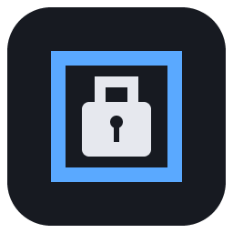

<p align="center"></p>

# Strongbox

A LAN-only, locally encrypted vault for hardware, website, e-mail and key credentials on a Raspberry Pi.

- **Types you define**: Hardware, Services, Websites, E-mail and Keys & licences to start; add your own with their own fields.
- **Nested entries**: a server holds its VMs, and a service (MediaLedger, Plex…) nests under the hardware it runs on.
- **Templates** (built in, or saved from any entry), **coloured tags**, **IP and MAC addresses** with extra network interfaces and a network table.
- **Safety net**: restore a backup from the app, rotate the encryption key, attachments, an emergency sheet, rotation reminders, a known-breached password check, read-only accounts, Wi-Fi QR codes, bulk actions.
- **Password generator** with presets and requirements (length, required kinds of characters, the symbols a device allows).
- **Many ways to sign in**: each account has a kind (password, PIN, fingerprint, hardware key, passkey, recovery key, or "signs in with another entry"), so one PC can hold all its logins and Plex can point at the Gmail account it uses.
- **Backup codes and recovery material**: sets of one-time codes you tick off (with a low-stock warning), security questions, app passwords, API tokens, SSH keys and recovery phrases.
- **Specs and notes** on every entry, tags, favorites, extra logins, password history, live authenticator codes.
- **Unlock like a Synology volume**: a passphrase, a key file, or both, plus an optional recovery key. Auto-locks when idle; a reboot locks it.
- **Encrypted at rest** (scrypt → AES-256-GCM, every record separately). Secrets are shown only on request and logged. A health report flags weak, reused, old and expiring items. Trash, activity log, encrypted backups.

Built on [Bracket](https://github.com/AxialForge/bracket): one core, a web shell for a Raspberry Pi behind Caddy, with the shared security model, themes, cards and the editable dashboard.

## Requirements

- Node 22.5 or newer (the core uses `node:sqlite`; nothing to `npm install` for the web server).

## Run

```bash
npm run dev                                   # web server on http://localhost:8083, data in ./.devdata
node app/server/server.js --data=.devdata --set-password
npm test
```

## Install on the Pi

```bash
curl -fsSL https://raw.githubusercontent.com/AxialForge/strongbox/main/server/install.sh -o strongbox-install.sh
sudo bash strongbox-install.sh
```

Then add the Caddy site block from [docs/RASPBERRY-PI.md](docs/RASPBERRY-PI.md).

## Documentation

- [docs/RASPBERRY-PI.md](docs/RASPBERRY-PI.md): installing on a Pi, Caddy or built-in HTTPS, hardening, restoring a backup.
- [docs/CREDENTIAL-TYPES.md](docs/CREDENTIAL-TYPES.md): backup codes, recovery phrases, security questions, tokens and the other things worth keeping, and where each goes.
- [docs/TWO-FACTOR.md](docs/TWO-FACTOR.md): how 2FA works (TOTP, recovery codes, security keys) and where Strongbox uses it.

## Development

Architecture, the extension points and the gotchas are in [CLAUDE.md](CLAUDE.md). The kit under `kit/` is
Bracket's and is never edited here; `npm run kit:upgrade` brings in a newer kit and shows the diff.

## License

MIT. See [LICENSE](LICENSE).
